# 1. Что делают оба приложения?
## TCP сервер

**Клиентская часть (первый код):**
- Принимает IP-адрес сервера, порт и размер буфера из аргументов командной строки
- Создает TCP-сокет и подключается к серверу
- Читает ввод с клавиатуры и отправляет его на сервер построчно
- Завершает работу при получении EOF (Ctrl+D)
**Запуск**
```
./tcp_client <ip> <port> <buffer_size>
```

**Серверная часть (второй код):**
- Принимает порт, размер буфера и размер очереди подключений из аргументов командной строки
- Создает TCP-сокет, привязывает его к указанному порту и начинает прослушивание
- Принимает входящие подключения в бесконечном цикле
- Читает данные от клиента и выводит их на стандартный вывод
- Обрабатывает подключения последовательно (один клиент за раз)
- Ставит клиенты в очередь для обработки (Задается в консоли)

**Запуск**
```
./tcp_server <port> <buffer_size> <listen_backlog>
```

**Взаимодействие:**
Клиент подключается к серверу, отправляет текстовые сообщения, которые сервер принимает и отображает. Сервер работает непрерывно, ожидая новые подключения после завершения текущего сеанса связи.

## UDP сервер

**Клиентская часть (первый код):**
- Принимает IP, порт сервера и размер буфера
- Создает UDP-сокет (SOCK_DGRAM)
- Читает строку с клавиатуры и отправляет ее серверу через `sendto()`
- **Ждет ответа от сервера** с помощью `recvfrom()` и выводит его
- Повторяет процесс для каждой введенной строки

**Запуск**
```
./udp_client <ip> <port> <buffer_size>
```
**Серверная часть (второй код):**
- Принимает порт и размер буфера
- Создает UDP-сокет, привязывает его к указанному порту
- В бесконечном цикле ожидает входящие сообщения через `recvfrom()`
- При получении сообщения выводит его вместе с IP-адресом и портом клиента
- **Отправляет обратно то же самое сообщение** (эхо-сервер) через `sendto()`

**Запуск**
```
./udp_server <port> <buffer_size>
```
**Отличие от TCP кода:**
1. **Без установления соединения** - нет `connect()/accept()/listen()`
2. **Нет гарантии доставки** - сообщения могут теряться
3. **Сохраняются границы сообщений** - каждое сообщение обрабатывается отдельно
4. **Сервер обрабатывает всех клиентов через один сокет** (в отличие от TCP, где для каждого клиента создается отдельный сокет)

# 2. Что произойдет, если tcpclient отправит сообщение незапущенному серверу?

Если TCP клиент попытается подключиться к незапущенному серверу, **вызов `connect()` завершится с ошибкой**.

**Процесс**:
1. Система попытается установить TCP-соединение
2. Не получит ответа от сервера (нет процесса, слушающего указанный порт)
3. Вернет ошибку **"Connection refused"** (ECONNREFUSED)
4. Клиентская программа завершится с соответствующим сообщением об ошибке

TCP требует, чтобы сервер был запущен и слушал порт **до** подключения клиента.

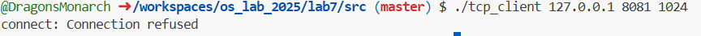

# 3. Что произойдет, если udpclient отправит сообщение незапущенному серверу?
Если UDP клиент отправит сообщение незапущенному серверу, **сообщение будет отправлено, но потеряно**.

**Процесс**:
1. UDP не проверяет доступность получателя
2. Система отправит датаграмму на указанный IP и порт
3. Так как там нет слушающего процесса, **сообщение будет просто отброшено**
4. Клиент **не получит никакой ошибки** на `sendto()`
5. Но при вызове `recvfrom()` (ожидание ответа) клиент **зависнет навсегда**, так как ответа никогда не будет
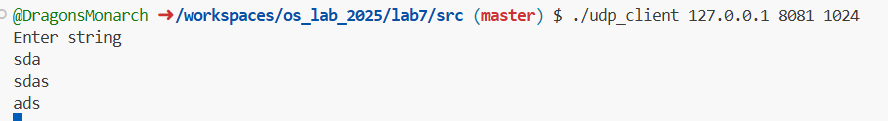

# 4. Что произойдет, если udpclient отправит сообщение незапущенному серверу?
Если TCP клиент отвалится во время работы (неожиданно завершится, потеряет связь и т.д.), сервер **обнаружит разрыв соединения**.

### Процесс:

**На клиенте:**
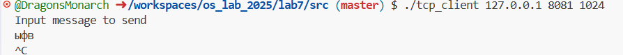

**На сервере:**
1. `read()` вернет **0** (EOF), что означает закрытие соединения клиентом
2. Сервер закроет свой сокет для этого клиента (`close(cfd)`)
3. Сервер продолжит работу и будет ждать новых подключений
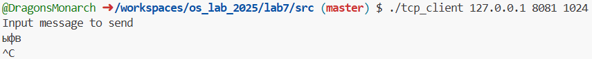

**Если клиент отвалился без корректного закрытия:**
- TCP обнаружит разрыв по таймауту или RST-пакету
- `read()` может вернуть **-1** с соответствующей ошибкой
- Или может вернуть **0** после получения FIN-пакета

**В коде из примера:**
- Внутренний цикл `while ((nread = read(cfd, buf, bufsize)) > 0)` завершится
- Сервер закроет соединение и вернется к `accept()` для ожидания нового клиента

TCP обеспечивает надежное определение состояния соединения через механизм handshake и keep-alive.

# 5. Что произойдет, если udpclient отвалится во время работы с сервером?

Если UDP клиент отвалится во время работы, **сервер ничего не заметит**.
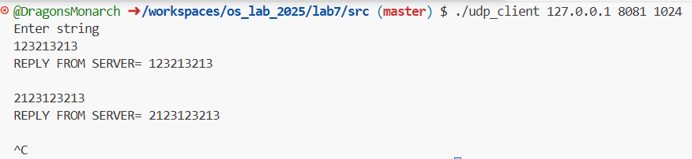
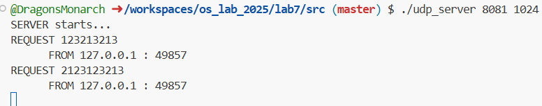
### Причины:
1. **UDP не отслеживает состояние соединения** - нет понятия "установленное соединение"
2. Сервер продолжит работу в бесконечном цикле `recvfrom()`, ожидая новых датаграмм
3. Если клиент отправил запрос и отвалился до получения ответа - ответ просто потеряется
4. Сервер не хранит информации о клиенте после обработки одного запроса

**В коде из примера:**
- Сервер просто ждет следующего сообщения от любого клиента через `recvfrom()`
- Нет никаких механизмов обнаружения "мертвых" клиентов
- Каждый запрос обрабатывается независимо

UDP - протокол без состояния, поэтому разрыв на стороне клиента **невидим** для сервера до тех пор, пока клиент не отправит новый запрос.

# 6. Что произойдет, если udpclient отправит сообщение на несуществующий / выключенный сервер?
Если UDP клиент отправит сообщение на **несуществующий или выключенный сервер**, то:

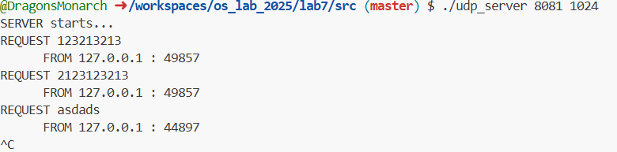
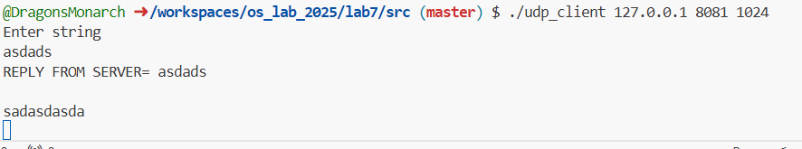

1. **Сообщение будет отправлено** - `sendto()` завершится успешно (вернет количество отправленных байт)
2. **Ответа не будет** - `recvfrom()` будет вечно ждать ответа, так как его никто не отправит
3. **Клиент зависнет** в ожидании ответа, который никогда не придет

**Детали:**
- На стороне клиента: `sendto()` → успех, затем `recvfrom()` → бесконечное ожидание
- На сетевом уровне: сообщение уйдет в сеть, достигнет указанного IP
- Если хост существует, но порт закрыт: хост отоброзит сообщение на хосте (за счет ошибки) "Port unreachable"
- Клиентская программа **заблокируется навсегда** в вызове `recvfrom()`

# 7. Что произойдет, если tcpclient отправит сообщение на несуществующий / выключенный сервер?

Если TCP клиент **уже подключился** к серверу, затем сервер выключился, и клиент попытается отправить еще одно сообщение:

1. **Первая попытка записи** после отключения сервера:
   - `write()` или `send()` **завершится успешно** на уровне приложения
   - Данные будут помещены в буфер TCP
   - Но доставка не произойдет

2. **TCP обнаружит проблему** при попытке передачи:
   - Протокол попытается повторно отправить данные
   - После нескольких неудачных попыток (таймауты повторной передачи)
   - TCP поймет, что соединение разорвано

3. **Последующие операции**:
   - Следующий `write()` получит ошибку **EPIPE** (сломанная труба)
   - Или `read()` вернет **0** (если сервер корректно закрыл соединение)
   - Либо следующая операция ввода-вывода получит сигнал **SIGPIPE** (если не обрабатывается)

4. **В коде из примера**:
   - Программа просто завершится
   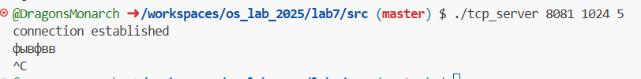
    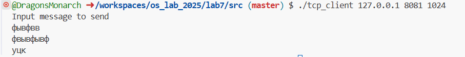

# 8. В чем отличия UDP и TCP протколов?


## 1. **Connection-oriented vs connectionless**
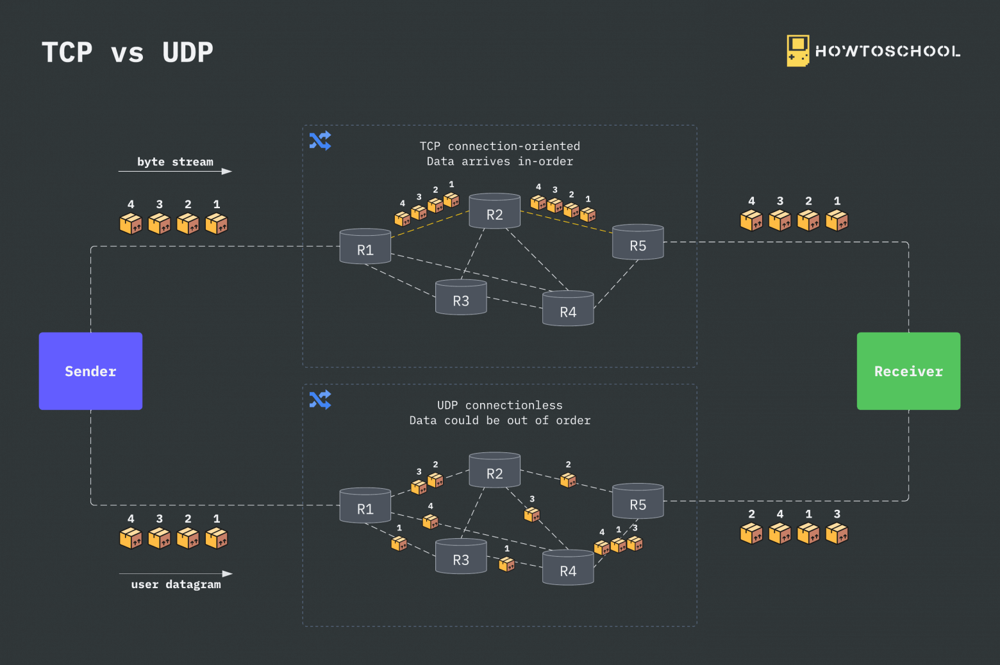
Существует два способа установить соединение перед отправкой данных с одного устройства на другое: с установлением соединения (connection-oriented, tcp) и без установления соединения (connectionless, udp). В первом случае создается сквозное соединение между отправителем и получателем перед передачей данных с сохранением порядка передачи пакетов. Во втором случае пакеты передаются между отправителем и получателем без создания какого-либо соединения. Пакеты проходят по разным маршрутам от отправителя к получателю, этот способ ненадежен и не гарантирует доставку пакетов.

## 2. **Three-way handshake vs. No handshake**

- **TCP**: Использует трехэтапное рукопожатие (SYN → SYN-ACK → ACK) для установки соединения
- **UDP**: Нет рукопожатия. Первый же пакет содержит данные

TCP является двунаправленной связью, другими словами, обе стороны могут «говорить». Прежде чем начать «говорить» мы должны обменяться приветствием, в случае с TCP в роли приветствия выступает случайный номер (ISN), который генерирует один участник соединения и направляет второму участнику, а тот в свою очередь должен увеличить этот номер на 1 (ISN + 1) и оправить обратно, дабы первый участник убедился, что сообщение получено.

Этот способ предотвращает проблем с подключением

## 3. **Header (20 bytes) vs. (8 bytes)**
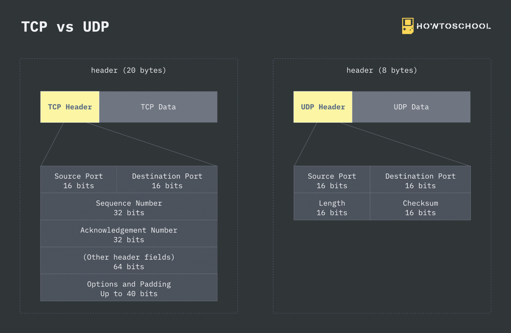
- **TCP**: Заголовок 20-60 байт (минимально 20). Содержит много полей: порты, номера последовательностей, флаги, контрольная сумма и т.д.
- **UDP**: Заголовок 8 байт. Только порты, длина и контрольная сумма

## 4. **Unicast & Multicast & Broadcast**
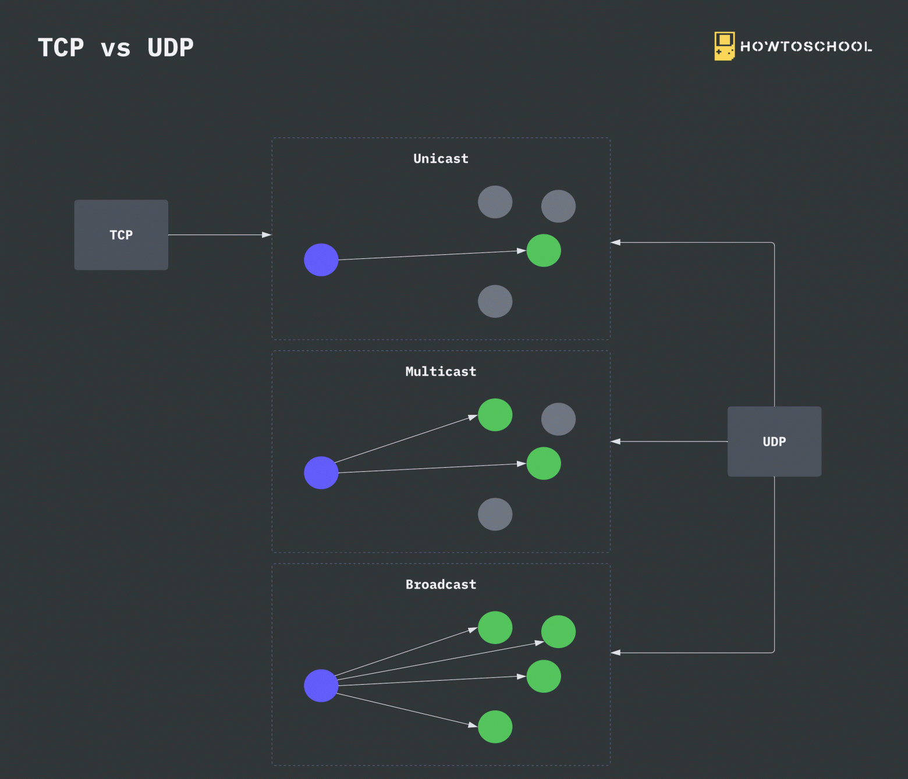
- **TCP**: Только **unicast** (один-к-одному)
- **UDP**: Поддерживает **unicast, multicast, broadcast** (один-ко-многим)

## 5. **Congestion control vs no congestion control**
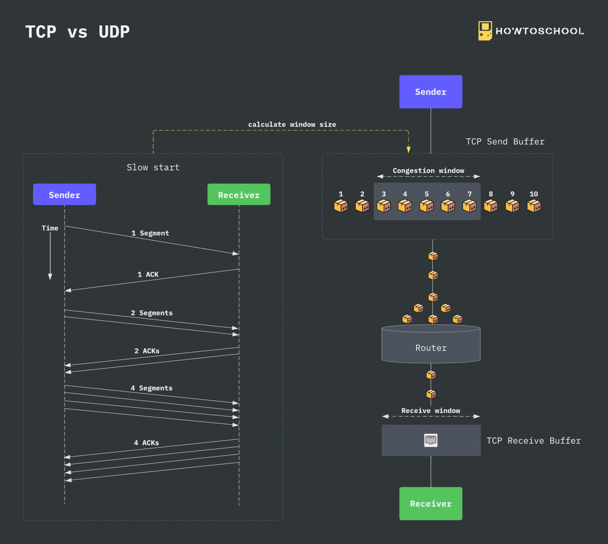
В процессе передачи данных по сети мы можем столкнуться с перегрузкой из-за перегрузки трафика в узлах, превышающего их пропускную способность. Это приводит к потере пакетов в сети и, как следствие, может серьезно навредить работе пользователя. 
- **TCP**: Имеет сложные механизмы контроля перегрузки (slow start, congestion avoidance, fast retransmit/recovery) **К примеру:** Алгоритм медленного старта работает за счёт увеличения окна TCP каждый раз, когда получено подтверждение, то есть увеличивает размер окна в зависимости от количества подтверждённых сегментов. Это происходит до тех пор, пока для какого-то сегмента не будет получено подтверждение или будет достигнуто какое-то заданное пороговое значение.
- **UDP**: Нет контроля перегрузки. Может "затопить" сеть трафиком

## 6. **Reliable vs lossy**
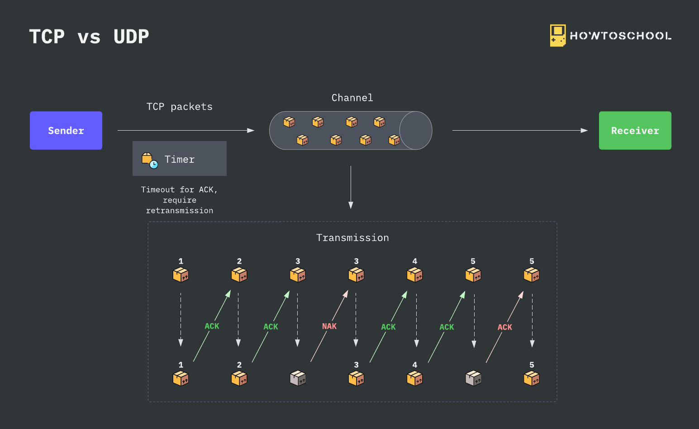
- **TCP**: Надежный. Гарантирует доставку, порядок и отсутствие дубликатов
- **UDP**: Ненадежный. Потеря, дублирование, нарушение порядка возможны

## 7. **Flow control vs No flow control**
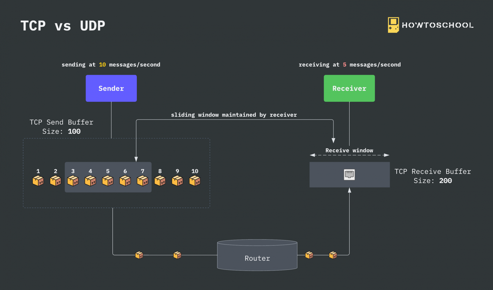
- **TCP**: Имеет управление потоком (окно скольжения). Получатель сообщает, сколько данных может принять
- **UDP**: Нет управления потоком. Отправитель может перегрузить получателя

## Также:

### **Обнаружение разрыва соединения:**
- TCP: Автоматически обнаруживает разрыв
- UDP: Не отслеживает состояние клиентов

### **Использование в примерах кода:**
- **TCP пример**: Подходит для передачи файлов, веб-страниц, где важна надежность
- **UDP пример**: Подходит для DNS, VoIP, потокового видео, где важна скорость

### **Производительность:**
- TCP: Больше накладных расходов, ниже скорость
- UDP: Минимальные накладные расходы, выше скорость